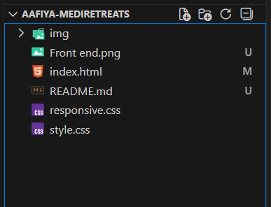

# Medical Treatment Website – Frontend Assignment

This project is a **frontend medical treatment website** built as an assignment using **HTML5 and CSS3**.  
The website represents a healthcare service page for **Total Knee Replacement**, designed with a clean, professional, and user-friendly layout.

---

## Features

- **Responsive Design** - Optimized for tablets and above with CSS media queries
- **Modern HTML5** - Semantic HTML structure for better accessibility and SEO
- **Professional Styling** - CSS3 with custom styling and responsive layouts
- **Interactive Elements** - JavaScript functionality for enhanced user experience

---

## Purpose of This Project

- Practice **HTML5 & CSS3**
- Improve page structuring and UI design
- Learn real-world healthcare website layout
- Deploy static websites using GitHub Pages

---

## File Structure



---

## Technologies Used

- **HTML5** – Semantic structure
- **CSS3** – Styling, layout, and responsiveness
- **GitHub Pages** – Deployment

---

## How to Run Locally

1. Clone the repository
   ```bash
   git clone https://github.com/your-username/your-repo-name.git
   ```
2. Open the folder
3. Run `index.html` in your browser
